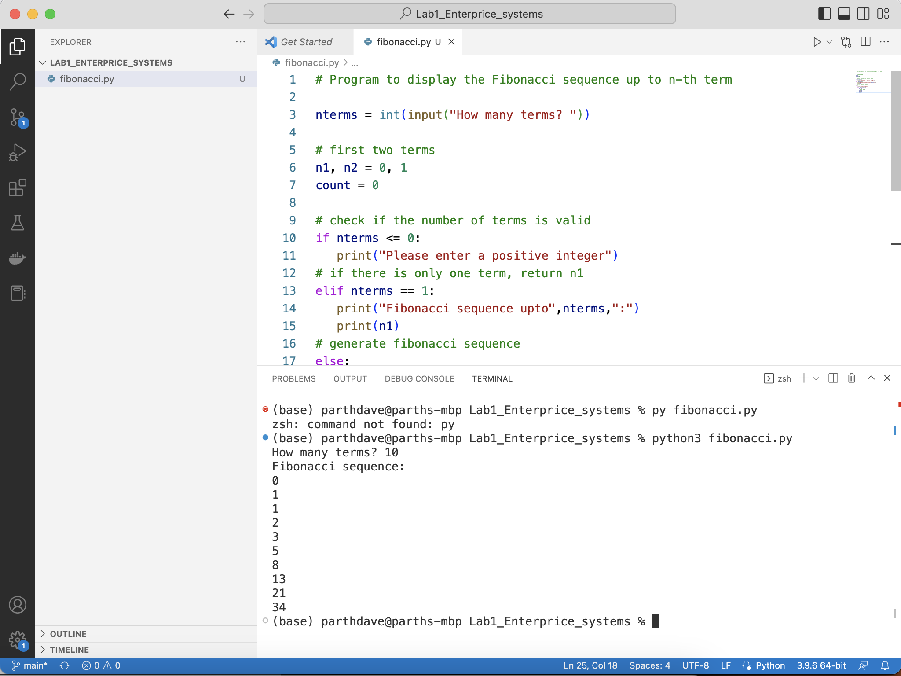

# Lab1 AI Enterprice Systems
A Fibonacci sequence is the integer sequence of 0, 1, 1, 2, 3, 5, 8....

The first two terms are 0 and 1. All other terms are obtained by adding the preceding two terms. This means to say the nth term is the sum of (n-1)th and (n-2)th term.

